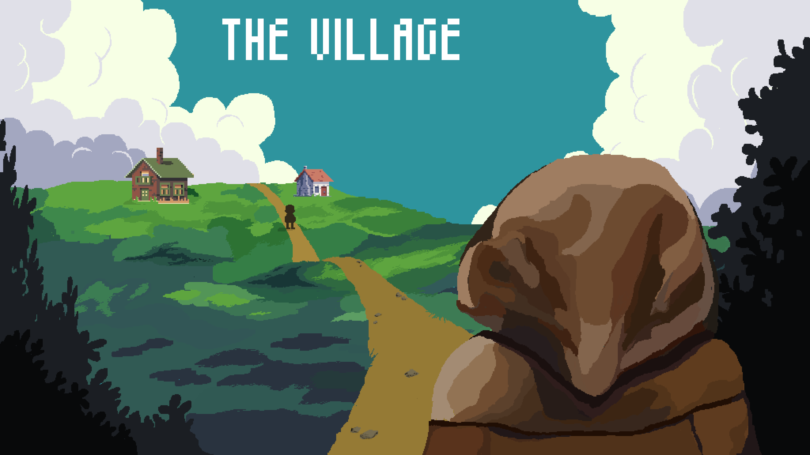
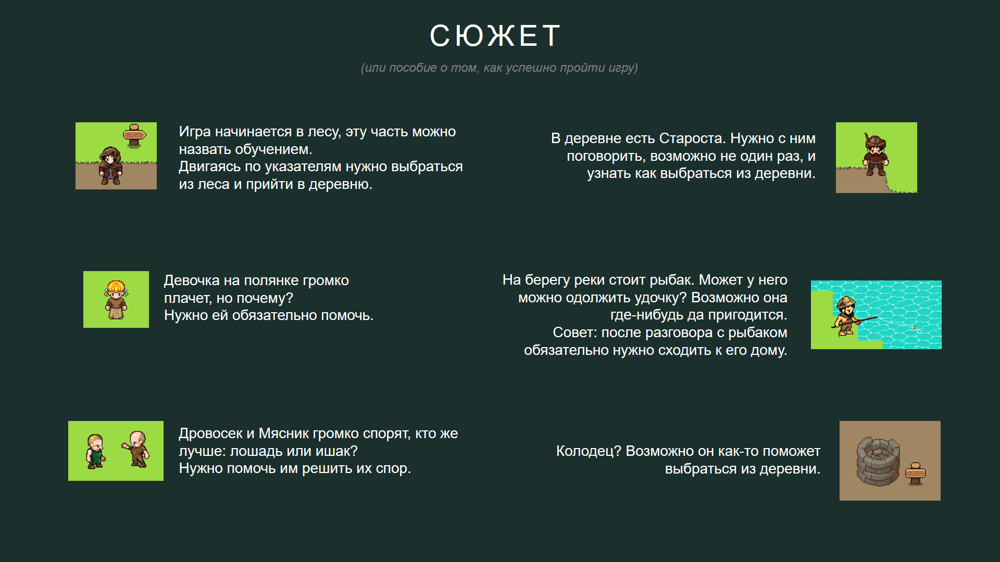
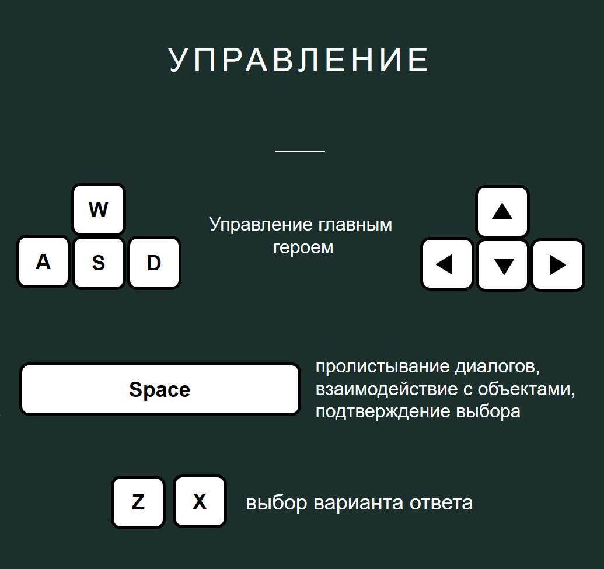
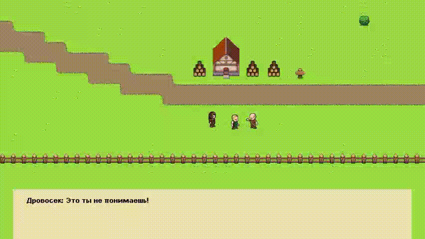

<h1 align="center">The Village</h1>

---

---

# Student game spring_2023

---

## Описание

Эта история о Попаданце, который случайно оказался в загадочной деревне. Он не знает, как сюда попал и что ему делать, но единственное, что он знает - это то, что ему нужно выбраться отсюда.

Деревня окружена лесом, рекой и забором, через которые Попаданец не может пройти. Ему придется искать другие способы, чтобы выбраться из этого места. В деревне живут местные жители, которые могут помочь ему в этом нелегком деле. Но не все они доброжелательны и готовы помочь безвозмездно.

Чтобы выбраться из деревни, Попаданцу нужно будет взаимодействовать с жителями и выполнять их задания. Он будет исследовать деревню и ее окрестности, искать подсказки и секреты.

Удастся ли ему выбраться из этого загадочного места? Это зависит только от вас.

___

___

___

## Геймплэй

Взаимодействие с персонажами через диалоги

Взаимодействие с объектами

Возможность выбора ответа, который влияет на продолжение диалога

___

## Дополнение

Собранный проект Вы можете скачать [здесь](https://disk.yandex.ru/d/BNjcSb_JirCGOQ).

Игра запускается на .net6.0
